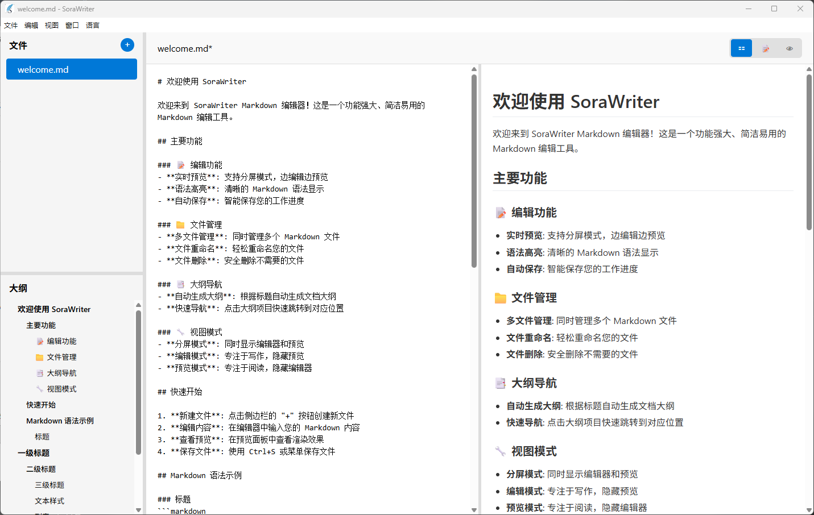

# SoraWriter


%20%7C%20macOS%20(theoretical)%20%7C%20Linux%20(theoretical)-lightgrey.svg)


SoraWriter 是一个现代化的 Markdown 编辑器，界面设计类似于 Typora，提供了流畅的写作体验和丰富的功能特性。

 

## 功能特性

### 核心功能
- **所见即所得编辑**：实时预览 Markdown 内容，提供流畅的写作体验
- **文件管理**：左侧文件浏览器，支持新建、打开、保存和重命名 Markdown 文件
- **大纲导航**：基于文档标题的结构化导航，支持多级标题（H1-H6），点击跳转到对应位置
- **可调整界面**：通过拖拽分隔条自定义工作空间布局
- **多语言支持**：支持中文和英文界面
- **滚动同步**：双屏模式下编辑窗口与预览窗口实时滚动同步

### 界面布局
- **左侧面板**：文件列表和大纲导航上下排列
- **文件列表**：显示文件名、大小和修改时间，类似现代编辑器的文件管理方式
- **中央编辑区域**：专注的 Markdown 编辑界面
- **预览窗口**：实时显示渲染效果，支持滚动同步
- **可调整大小**：拖拽分隔条调整各面板尺寸

### 编辑功能
- **标题支持**：支持 H1-H6 多级标题，自动生成大纲结构
- **实时预览**：编辑时即时显示格式化效果，支持滚动同步
- **快捷操作**：通过菜单或快捷键快速执行文件操作
- **智能跳转**：点击大纲中的标题，编辑器自动将对应标题滚动到页面顶部
- **文件重命名**：支持重命名文件，自动同步更新磁盘文件名

## 安装和运行

### 系统要求
- **Windows 7 及以上版本** ✅ (已测试)
- **macOS 10.10 及以上版本** ⚠️ (理论支持，未测试)
- **Linux (Ubuntu 12.04+, Fedora 21+, Debian 8+)** ⚠️ (理论支持，未测试)

> **注意**: 目前只在 Windows 平台上进行了完整测试。macOS 和 Linux 平台具备技术支持能力，但尚未进行实际验证。

### 开发环境设置
```bash
# 克隆项目
git clone https://github.com/sora-yyds/SoraWriter.git
cd SoraWriter

# 安装依赖
npm install

# 启动开发环境
npm run start

# 构建应用
npm run make
```

> **开发者工具**: 应用默认不开启开发者工具。如需调试，可以通过菜单 "视图" > "切换开发者工具" 或按 `F12` 开启。

## 打包发布

### 打包准备

在打包发布之前，请确保以下文件和配置已准备好：

#### 必需文件
- `src/` - 源代码目录
  - `main.js` - 主进程文件
  - `renderer.js` - 渲染进程文件
  - `preload.js` - 预加载脚本
  - `index.html` - 主页面
  - `index.css` - 样式文件
  - `locales/` - 多语言文件
  - `utils/` - 工具函数
- `assets/` - 资源文件目录
  - `welcome.md` - 中文欢迎文档
  - `welcome-en.md` - 英文欢迎文档
- `package.json` - 项目配置
- `forge.config.js` - 打包配置

#### 配置检查
```bash
# 检查项目信息
npm list --depth=0

# 检查打包配置
cat forge.config.js
```

### 打包命令

#### 开发调试
```bash
# 启动开发环境
npm run start
```

#### 生产打包
```bash
# 打包应用程序（生成可执行文件）
npm run package

# 创建安装包（包含安装程序）
npm run make

# 发布到分发平台（如配置）
npm run publish
```

### 打包输出

#### Package 输出
运行 `npm run package` 后，会在 `out/` 目录生成：
- **Windows**: `out/SoraWriter-win32-x64/SoraWriter.exe` ✅ (已验证)
- **macOS**: `out/SoraWriter-darwin-x64/SoraWriter.app` ⚠️ (未测试)
- **Linux**: `out/SoraWriter-linux-x64/sorawriter` ⚠️ (未测试)

#### Make 输出
运行 `npm run make` 后，会生成安装包：
- **Windows**: `.exe` 安装程序（Squirrel）✅ (已验证)
- **macOS**: `.zip` 压缩包 ⚠️ (未测试)
- **Linux**: `.deb` 和 `.rpm` 包 ⚠️ (未测试)

### 跨平台打包

SoraWriter 基于 Electron 构建，理论上支持跨平台打包。目前已在 Windows 上验证，其他平台支持情况：

```bash
# 为特定平台打包（需要相应平台环境）
npm run package -- --platform=win32 --arch=x64    # Windows ✅
npm run package -- --platform=darwin --arch=x64   # macOS ⚠️
npm run package -- --platform=linux --arch=x64    # Linux ⚠️

# 生成特定平台安装包
npm run make -- --platform=win32    # Windows ✅
npm run make -- --platform=darwin   # macOS ⚠️
npm run make -- --platform=linux    # Linux ⚠️
```

> **重要提示**: 
> - ✅ **Windows**: 已完全测试和验证
> - ⚠️ **macOS/Linux**: 具备技术支持，但需要在相应平台上进行测试和验证
> - 跨平台打包通常需要在目标平台上进行，或使用 CI/CD 服务

### 发布流程

1. **更新版本号**
   ```bash
   npm version patch  # 补丁版本
   npm version minor  # 次要版本
   npm version major  # 主要版本
   ```

2. **完整构建**
   ```bash
   # 清理之前的构建
   rm -rf out/
   
   # 重新安装依赖
   npm ci
   
   # 生成生产版本
   npm run make
   ```

3. **测试发布版本**
   - 运行生成的可执行文件
   - 测试所有核心功能
   - 验证资源文件加载正常
   - 检查多语言切换

4. **分发**
   - 上传到 GitHub Releases
   - 发布到应用商店（如需要）
   - 提供下载链接

### 自定义配置

#### 应用图标
SoraWriter 已配置了应用图标：
- **Windows**: `assets/favicon.ico` ✅
- **macOS**: 自动从 `.ico` 生成 `.icns` ⚠️ (未测试)
- **Linux**: 自动从 `.ico` 生成 `.png` ⚠️ (未测试)

当前配置在 `forge.config.js` 中：
```javascript
packagerConfig: {
  icon: './assets/favicon' // Electron 会自动选择合适的格式
}
```

如需更换图标，替换 `assets/favicon.ico` 文件即可。

#### 签名和公证（可选）
对于生产环境，建议配置代码签名：
- **Windows**: 配置 Authenticode 签名
- **macOS**: 配置 Apple Developer 签名和公证

详细配置请参考 [BUILD_GUIDE.md](BUILD_GUIDE.md)。

### 常见问题

#### 打包失败
```bash
# 清理缓存重试
npm cache clean --force
rm -rf node_modules/
npm install
npm run package
```

#### 资源文件未包含
检查 `forge.config.js` 中的 `extraResource` 配置：
```javascript
extraResource: [
  './assets'
]
```

#### 运行时错误
- 检查主进程和渲染进程的文件路径
- 验证 preload 脚本的 API 暴露
- 确认资源文件在打包后的正确路径

#### 跨平台兼容性问题
**目前状态**:
- ✅ **Windows**: 已完全测试，功能正常
- ⚠️ **macOS**: 理论支持，但可能需要调整：
  - 文件路径分隔符差异
  - 菜单栏集成（macOS 特有）
  - 快捷键映射
- ⚠️ **Linux**: 理论支持，但可能需要调整：
  - 不同发行版的兼容性
  - 桌面环境集成
  - 文件关联设置

**如需跨平台支持**，建议：
1. 在目标平台上进行实际测试
2. 针对平台特性进行代码调整
3. 设置 CI/CD 进行多平台自动化测试

## 使用方法

### 基本操作
1. **创建新文件**：点击左侧文件列表中的 "+" 按钮
2. **打开文件**：通过菜单 "文件" > "打开文件" 或使用快捷键 `Ctrl/Cmd + O`
3. **保存文件**：通过菜单 "文件" > "保存" 或使用快捷键 `Ctrl/Cmd + S`
4. **另存为**：通过菜单 "文件" > "另存为" 或使用快捷键 `Ctrl/Cmd + Shift + S`

### 界面操作
1. **调整面板大小**：拖拽左侧栏或中间的分隔条调整面板尺寸
2. **使用大纲导航**：在大纲中点击标题可快速跳转到对应位置（标题会滚动到页面顶部）
3. **文件管理**：在文件列表中右键或点击按钮可重命名、删除文件
4. **滚动同步**：在双屏模式下，编辑窗口滚动时预览窗口会自动同步滚动
5. **切换语言**：通过菜单 "语言" 选项切换中英文界面

### Markdown 语法支持
- 标题：使用 `#` 创建 H1-H6 标题
- 粗体：使用 `**粗体**` 或 `__粗体__`
- 斜体：使用 `*斜体*` 或 `_斜体_`
- 列表：使用 `-` 或数字创建无序/有序列表
- 链接：使用 `[链接文本](URL)` 创建链接
- 图片：使用 `` 插入图片

## 快捷键

| 功能     | Windows/Linux    | macOS         |
|----------|------------------|---------------|
| 新建文件 | `Ctrl + N`       | `Cmd + N`     |
| 打开文件 | `Ctrl + O`       | `Cmd + O`     |
| 保存文件 | `Ctrl + S`       | `Cmd + S`     |
| 另存为   | `Ctrl + Shift + S` | `Cmd + Shift + S` |
| 开发者工具 | `F12`           | `F12`         |

## 技术栈

- **Electron**：跨平台桌面应用框架
- **HTML/CSS/JavaScript**：前端界面技术
- **Node.js**：运行时环境
- **Electron Forge**：应用打包和分发工具
- **Webpack**：模块打包器
- **Marked**：Markdown 解析库

## 项目结构

```
SoraWriter/
├── src/                    # 源代码目录
│   ├── main.js            # 主进程
│   ├── renderer.js        # 渲染进程
│   ├── preload.js         # 预加载脚本
│   ├── index.html         # 主页面
│   ├── index.css          # 样式文件
│   ├── locales/           # 国际化文件
│   │   ├── zh-CN.js       # 中文语言包
│   │   └── en-US.js       # 英文语言包
│   └── utils/             # 工具函数
│       └── i18n.js        # 国际化工具
├── assets/                # 资源文件
│   ├── welcome.md         # 中文欢迎文档
│   └── welcome-en.md      # 英文欢迎文档
├── forge.config.js        # Electron Forge 配置
├── webpack.*.config.js    # Webpack 配置文件
├── package.json           # 项目配置
├── BUILD_GUIDE.md         # 详细构建指南
└── README.md              # 项目说明
```

## 贡献

欢迎提交 Issue 和 Pull Request 来改进 SoraWriter。

### 开发贡献指南

1. Fork 本项目
2. 创建功能分支：`git checkout -b feature/amazing-feature`
3. 提交更改：`git commit -m 'Add some amazing feature'`
4. 推送到分支：`git push origin feature/amazing-feature`
5. 提交 Pull Request

### 报告问题

如果您发现了 bug 或有功能建议，请：
1. 查看现有的 Issues
2. 创建新的 Issue，详细描述问题或建议
3. 提供复现步骤（对于 bug）

## 更新日志

### v1.0.0 (2025-08-18)
-  首次发布
-  完整的 Markdown 编辑功能
-  文件管理和大纲导航
-  多语言支持（中英文）
-  现代化的用户界面
-  三种视图模式（分屏/编辑/预览）
-  可调整的界面布局
-  双屏模式下编辑和预览窗口滚动同步
-  统一样式的提示弹窗和对话框
-  大纲导航精准跳转（点击标题滚动到页面顶部）
-  优化文件列表显示（显示文件大小和修改时间）
-  完整的文件重命名功能（同步更新磁盘文件名）
-  修复文件切换时预览窗口同步更新

## 致谢

- [Electron](https://electronjs.org/) - 跨平台桌面应用框架
- [Marked](https://marked.js.org/) - Markdown 解析器
- [Electron Forge](https://electronforge.io/) - 打包和分发工具

## 许可证

本项目基于 [GPL 许可证](LICENSE) 开源。

---

**SoraWriter** - 让写作更美好 ✨
